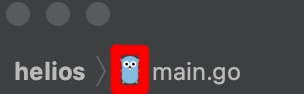

Helios
--

[](https://www.repostatus.org/#wip)
[](LICENSE.md)

Helios is a GUI automation tool written in Go - it automates anything that you can see on your screen. Helios uses 
image recognition powered by OpenCV under-the-hood. You can use Helios to automate GUI testing, video games and more.

Example:

```go
package main

import "github.com/j7mbo/helios"

func main() {
    // Load .gopher.png and expect to find it at 0.9 / 1.0 confidence
    gopherImage, _ := NewImage("./gopher.png", 0.9)
    // Find the gopher image on-screen
    gopher := screen.Find(gopherImage)
    // Highlight it for two seconds
    gopher.Highlight(2 * time.Second)
    // Click at a random (X,Y) coordinate within the matched box
    gopher.Click()
}
```

The Gopher from Goland, highlighted for 2 seconds:



Docs
---

TBD...


Upcoming work
---

- [ ] Ability to define `Region`s to search
- [ ] Abstraction for `finder`
- [ ] Support and releases for Windows, Linux (MacOS already supported)
- [ ] Wait X seconds for an image to appear
- [ ] Support for multiple screens
- [ ] #1
- [ ] Embedding OpenCV directly, 0 dependency binary (need help with this)
- [ ] API for interfacing with other languages 
- [ ] OCR, text extraction
- [ ] GUI for region and image selection, scripting language (this'll be a fun one)
- [ ] Tests...
